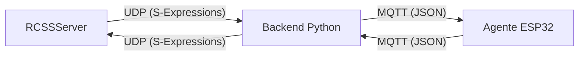

# Documentación del Sistema RoboCup (ESP32 + Python Backend)

Esta documentación explica la arquitectura, comunicación y flujo de datos del sistema, diseñado para permitir que un microcontrolador ESP32 actúe como el "cerebro" de un jugador en el simulador RoboCup Soccer Server (RCSS).

## Arquitectura General

El sistema utiliza una arquitectura de **Cerebro Remoto**:

1.  **RCSSServer (Simulador):** Ejecuta la física y reglas del juego.
2.  **Backend (Python):** Actúa como puente (proxy). Se conecta al simulador vía UDP y expone una interfaz MQTT para los agentes.
3.  **Agente (ESP32 / C++):** Recibe datos de sensores procesados y decide qué acción tomar.



---

## Comunicación

La comunicación entre el Backend y el Microcontrolador se realiza mediante el protocolo **MQTT**.

### Configuración MQTT
-   **Broker:** Configurable (por defecto `localhost` o IP de la PC).
-   **Puerto:** 1883.
-   **QoS:** 0 o 1.

### 1. Backend -> Micro (Sensores y Estado)

El backend recibe los mensajes crudos del simulador (S-Expressions), los parsea y envía un resumen en formato JSON al microcontrolador.

-   **Tópico:** `game/state/<DEVICE_ID>` (ej. `game/state/ESP_01`)
-   **Frecuencia:** ~20Hz (configurable, con rate limiting).
-   **Formato JSON:**

```json
{
  "status": "PLAYING",          // Estados: IDLE, BEFORE_KICK_OFF, PLAYING, FINISHED
  "role": "STRIKER",            // Roles: STRIKER, GOALKEEPER, DEFENDER, etc.
  "sensors": {
    "ball": {
      "dist": 10.5,             // Distancia en metros
      "angle": -5.0,            // Ángulo en grados
      "visible": true
    },
    "goal": {
      "dist": 20.0,
      "angle": 0.0,
      "visible": true
    },
    "teammates": [
      { "id": 2, "dist": 5.0, "angle": 10.0 }
    ],
    "flags": [                  // Banderas para triangulación
      { "name": "f c", "dist": 15.0, "angle": 30.0 }
    ],
    "position": {               // Posición estimada (calculada por backend o micro)
      "x": -10.0,
      "y": 5.0,
      "heading": 0.0,
      "valid": true
    }
  }
}
```

### 2. Micro -> Backend (Acciones)

El microcontrolador procesa los sensores y decide una acción, enviándola de vuelta al backend en formato JSON.

-   **Tópico:** `player/action/<DEVICE_ID>` (ej. `player/action/ESP_01`)
-   **Formato JSON:**

```json
{
  "action": "dash",             // Tipos: dash, turn, kick, catch, move
  "params": [100.0, 0.0]        // Parámetros variables según la acción
}
```

#### Tipos de Acciones y Parámetros:

| Acción | Params[0] | Params[1] | Descripción |
| :--- | :--- | :--- | :--- |
| `dash` | Potencia (0-100) | Dirección (grados) | Moverse en una dirección. |
| `turn` | Momento (-180 a 180) | N/A | Girar sobre su eje. |
| `kick` | Potencia (0-100) | Dirección (grados) | Patear el balón. |
| `catch`| Dirección (grados)| N/A | Atrapar el balón (solo Goalkeeper). |
| `move` | X (-52.5 a 52.5) | Y (-34 a 34) | Teletransportar (solo antes del kickoff). |

---

## Código C++ (Microcontrolador)

El código del agente se encuentra dividido en:

1.  **Plataforma (`platform-esp32/`):** Manejo de hardware, WiFi, MQTT y FreeRTOS.
    -   `main/main_esp32.cpp`: Punto de entrada, tareas de FreeRTOS, loop principal.
2.  **Lógica Común (`common-cpp/`):** Lógica de juego pura, agnóstica del hardware.
    -   `include/messages.h`: Estructuras de datos (`SensorData`, `Action`).
    -   `include/game_logic.h`: Máquina de estados y toma de decisiones (`decide_action`).

### Flujo de Ejecución (Micro)

1.  **Inicio:** Se conecta a WiFi y MQTT.
2.  **Loop:**
    -   Espera mensaje en `game/state/<ID>`.
    -   Parsea JSON a estructura `SensorData`.
    -   Llama a `game_logic.decide_action(sensors)`.
    -   Obtiene estructura `Action`.
    -   Serializa `Action` a JSON.
    -   Publica en `player/action/<ID>`.

---

## Guía para Jugar

### Requisitos Previos
1.  **RCSSServer:** Instalado y funcional.
2.  **Python 3.x:** Con dependencias (`requirements.txt`).
3.  **ESP32:** Configurado y flasheado (o usar `platform-pc` para simular sin hardware).

### Pasos

1.  **Iniciar el Simulador:**
    ```bash
    rcssserver
    ```

2.  **Iniciar el Backend:**
    Navegar a `backend-python` y ejecutar:
    ```bash
    python -m src.app
    ```
    Esto iniciará el servidor Flask (Web UI) y el cliente MQTT.

3.  **Iniciar el Agente (ESP32):**
    -   Asegúrate de que el ESP32 tenga las credenciales WiFi y la IP de tu PC (Broker MQTT) configuradas en `menuconfig`.
    -   Enciende el ESP32. Debería conectarse y empezar a jugar automáticamente.

    **Alternativa (Agente PC):**
    Si no tienes el ESP32 a mano, puedes correr la versión de PC:
    ```bash
    ./build/platform-pc/agent_pc tcp://localhost:1883 ESP_01
    ```

4.  **Controlar la Partida:**
    -   Abre el navegador en `http://localhost:5001` (o el puerto configurado).
    -   Usa el panel para iniciar/detener la simulación, asignar roles y ver logs en tiempo real.

### Solución de Problemas Comunes

-   **El agente no se mueve:**
    -   Verificar conexión MQTT.
    -   Verificar que el backend esté recibiendo mensajes del RCSSServer (logs de Python).
    -   Asegurarse de que el estado del juego sea `PLAYING` (usar `kick_off` en el simulador o UI).

-   **Latencia alta:**
    -   El sistema tiene un rate limiter. Ajustar `MIN_SEND_INTERVAL_MS` en C++ o `SENSOR_PUBLISH_INTERVAL` en Python si es necesario.
